

# اسنپ‌وو پلاگین یکپارچه سازی محصولات و سفارشات اسنپ شاپ و ووکامرس

اسنپ‌وو افزونه‌ای رایگان، بازمتن و حرفه‌ای برای اتصال فروشگاه‌های ووکامرسی به پنل فروشندگان اسنپ شاپ است. این ابزار به صاحبان فروشگاه‌ها این امکان را می‌دهد تا موجودی، قیمت و تخفیف محصولات خود را بدون نیاز به ورود دستی یا دوباره‌کاری، مستقیماً از وردپرس به اسنپ شاپ منتقل کرده و بین این دو پلتفرم هماهنگی کامل برقرار کنند. اسنپ‌وو به‌گونه‌ای طراحی شده که راه‌اندازی آن بسیار سریع، ساده و بدون نیاز به تخصص فنی باشد؛ فقط کافی است کلید وب سرویس اسنپ شاپ را وارد کنید تا اتصال هوشمند بین فروشگاه شما و مارکت‌پلیس اسنپ شاپ آغاز شود.

این پلاگین راه‌حلی است برای مشکلی رایج در میان فروشندگانی که به‌طور هم‌زمان در سایت شخصی و اسنپ شاپ فعالیت می‌کنند: هماهنگ نبودن قیمت و موجودی، دوباره‌کاری وقت‌گیر، خطاهای انسانی، و نبود یکپارچگی در داده‌های محصول. اسنپ‌وو با قابلیت‌هایی مانند زمان‌بندی خودکار بروزرسانی، همگام‌سازی دستی یا گروهی، پشتیبانی از فایل اکسل و همگام‌سازی با SKU یا ایجاد محصول جدید، دقیقاً به نیازهای متنوع فروشندگان ایرانی پاسخ می‌دهد. حتی می‌توانید از داخل صفحه محصول در ووکامرس، وضعیت موجودی و قیمت اسنپ شاپ را ببینید و آن را همگام‌سازی کنید.

---

# ما در حال انتشار تدریجی پلاگین هستیم. اگر شما یکی از ۵۰ فروشگاه اول باشید، نسخه را رایگان، زودتر از همه، و با پشتیبانی مستقیم دریافت طی ۱–۳ روز آینده دریافت خواهید کرد.  
برای دریافت این فرم را تکمیل نمایید:  
https://survey.porsline.ir/s/8wD9OBj

---

## 🎯 چرا اسنپ‌وو؟

فروشندگان زیادی به‌طور هم‌زمان در ووکامرس و اسنپ شاپ فعالیت می‌کنند، اما با مشکلاتی مانند:

- دوباره‌کاری در وارد کردن اطلاعات
- خطاهای انسانی
- نبود یکپارچگی در موجودی و قیمت

مواجه‌اند. اسنپ‌وو این مشکل را با امکانات هوشمند و رابط کاربری ساده حل می‌کند.

---

## ✨ امکانات کلیدی

- 🔓 کاملاً رایگان و **بازمتن**
- ⚙️ راه‌اندازی سریع با وارد کردن API Key
- 📊 داشبورد حرفه‌ای برای وضعیت همگام‌سازی
- ⏰ همگام‌سازی خودکار با زمان‌بندی دلخواه (۳ روش مختلف)
- 📝 ثبت گزارش کامل فرآیندهای همگام‌سازی
- 🔁 پشتیبانی از **۵ روش یکسان‌سازی**:
  - خودکار
  - دستی و انتخابی
  - بر اساس فایل اکسل
  - ایجاد محصول جدید در ووکامرس
  - یکسان‌سازی از صفحه محصول
- 👁️ نمایش قیمت و موجودی اسنپ شاپ داخل لیست محصولات ووکامرس
- 🏷️ همگام‌سازی تخفیف و تعداد محصولات تخفیف‌دار

---

## 🖼️ اسکرین‌شات‌ها

| صفحه | نمای کلی |
|------|----------|
| داشبورد | 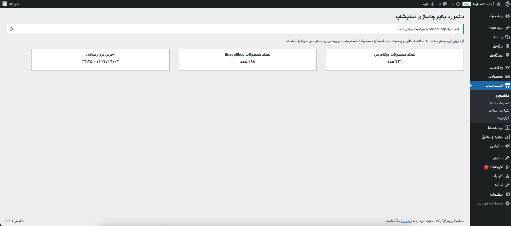 |
| تنظیمات اتصال | 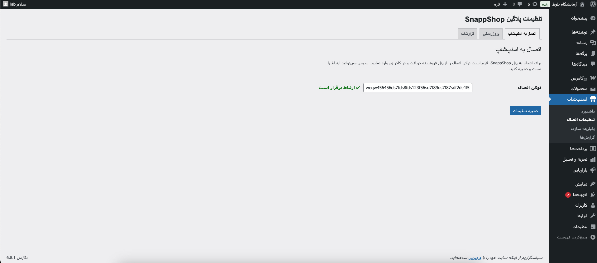 |
| تنظیمات بروزرسانی | 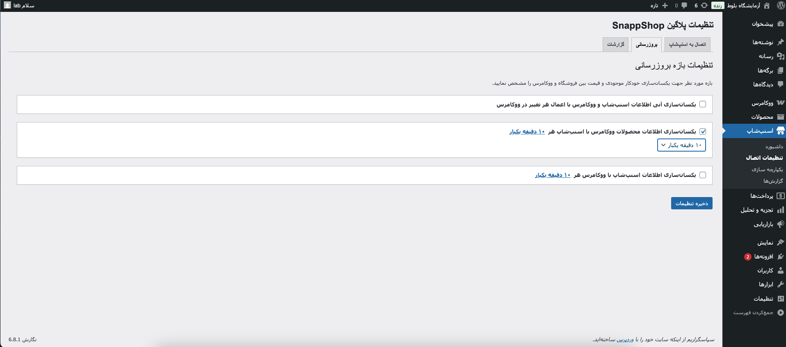 |
| تنظیمات گزارش گیری |  |
| یکسان سازی | 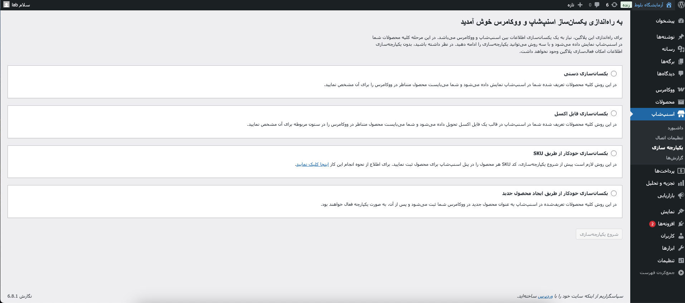 |
| یکسان سازی دستی محصولات و جزئیات |  |
| یکسان سازی با فایل اکسل و جزئیات | 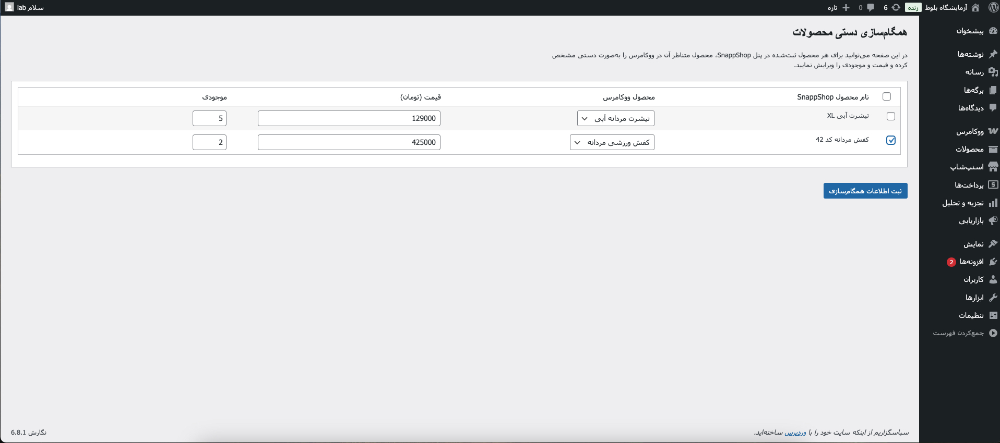 |
| یکسان سازی خوکار محصولات و جزئیات | 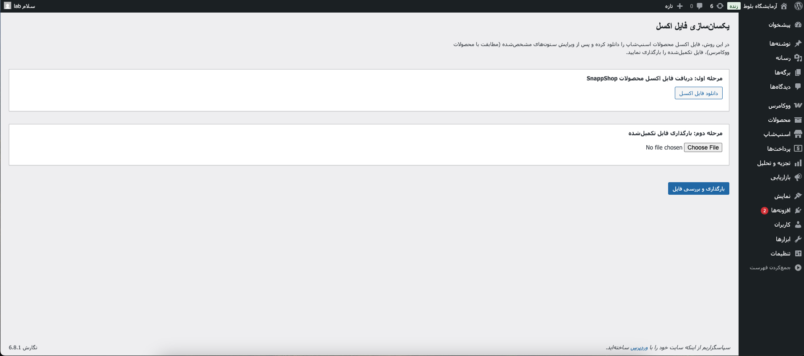 |
| یکسان سازی خودکار محصولات و جزئیات با ایجاد محصول جدید | 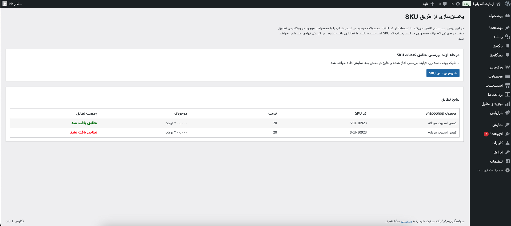 |
| گزارش‌ها | 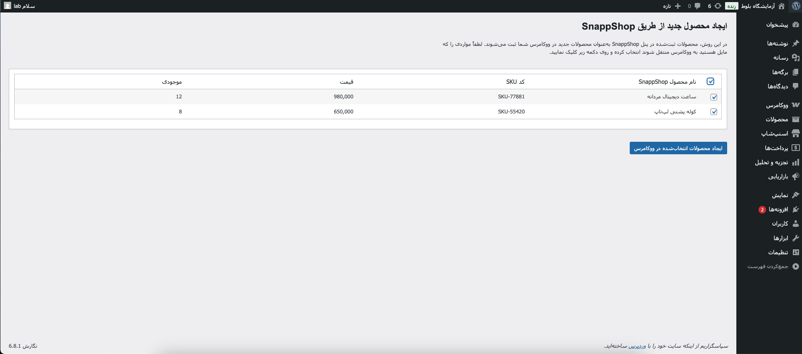 |
| نمایش جزئیات در لیست محصولات | 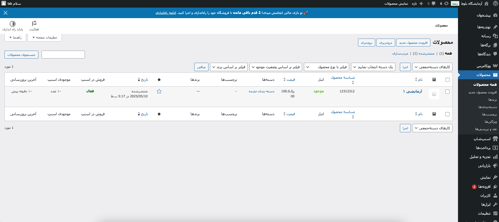 |
| گزارش‌ها |  |
| ویجت بروز رسانی تکی در صفحه ویرایش محصول | 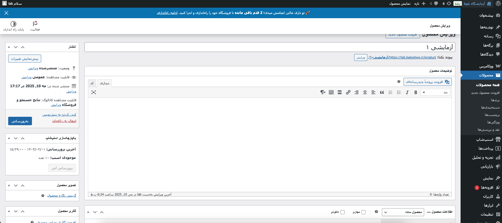 |
| یکسان سازی بازه تخفیف و موجودی با ووکامرس | 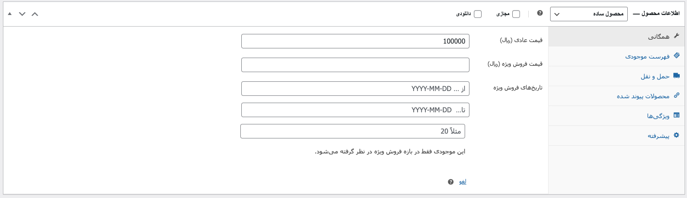 |

| و ... | سایر تصاویر در پوشه `screenshots` موجود است. |

